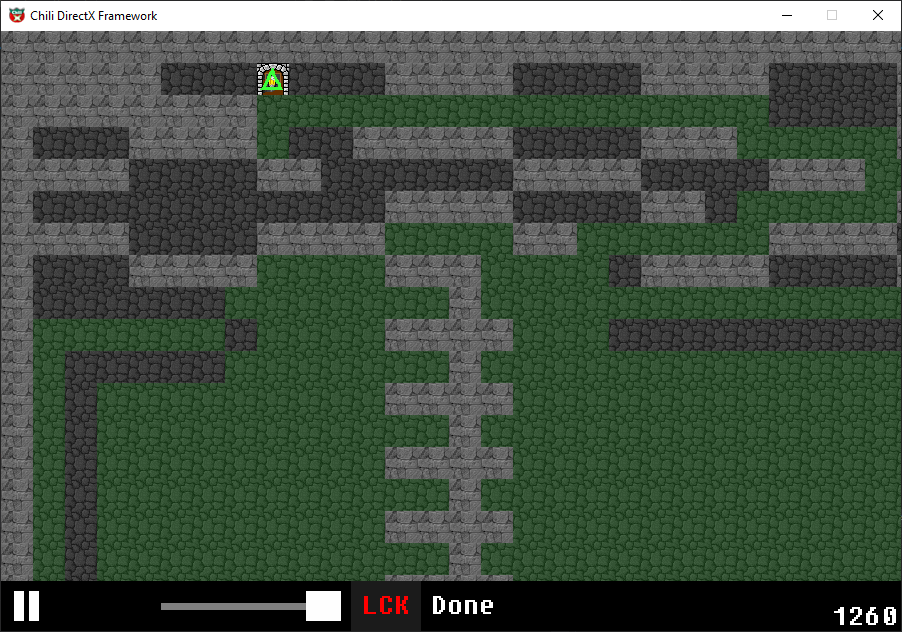
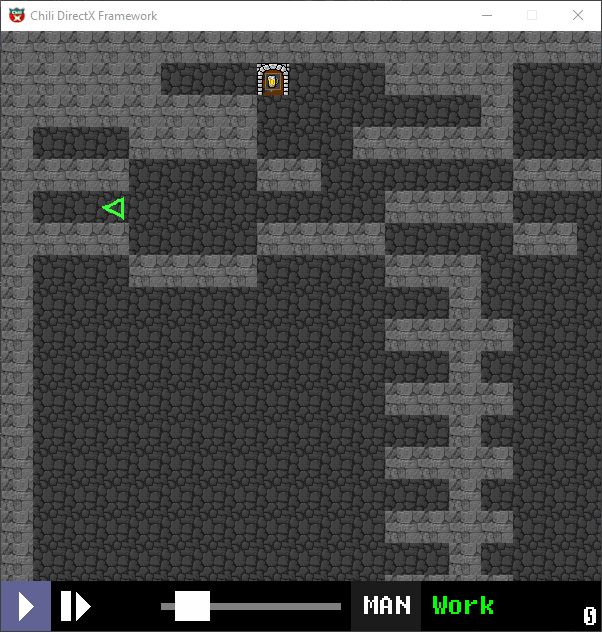

My DFS implementation of the RoboMaze Pathfinding challenge #RoboMaze

It's a simple algo, but the challenge was in interfacing with the framework, which only returns field information for three cells in the forward field of visibility of the robot and only accepts three movement control commands (turn left, turn right, move forward).
My solution is in the folder RoboAI/RoboAI.h

Framework & sources:
Robot maze arena for Planet Chili code challenges 
https://youtu.be/oOkOHazuqeQ
https://forum.planetchili.net/viewtopic.php?t=4243
http://www.planetchili.net

